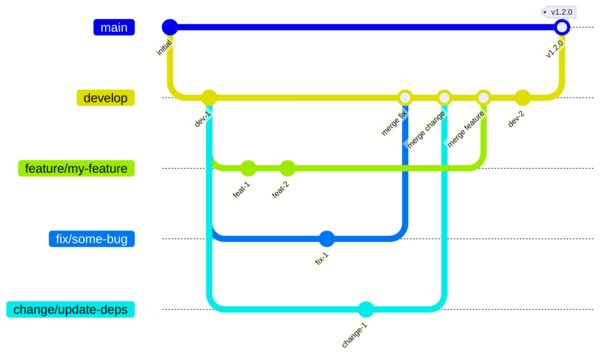

# Branching Strategy

## Branch Overview

| Branch | Role | Direct commits |
| ------ | ---- | -------------- |
| `master` | Stable releases. Every commit is tagged with a version. | Never |
| `develop` | Integration branch. All work lands here via pull request. | Never |
| `feature/<name>` | New functionality. Branched from `develop`, merged back via PR. | Yes |
| `fix/<name>` | Bug fixes. Branched from `develop` (or `master` for hotfixes), merged back via PR. | Yes |
| `change/<name>` | Refactors, dependency updates, config changes. Branched from `develop`, merged back via PR. | Yes |

---

## Rules

- Never commit directly to `master` or `develop`.
- Every merge into `develop` requires a pull request and at least one review.
- Branch names use `kebab-case` after the prefix: `feature/serial-timeout`, `fix/crc-overflow`, `change/update-cmake`.
- Delete the branch after the pull request is merged.
- **Never squash commits when merging.** Every individual commit must remain visible in the history so the full context of a change can be traced.
- Tag `master` after every release using semantic versioning: `v1.2.0`.

---

## Workflow



### Step-by-step

1. **Branch from `develop`:**
   ```
   git checkout develop
   git pull
   git checkout -b feature/my-feature
   ```

2. **Work and push commits** — each commit should be small and focused.

3. **Open a pull request** targeting `develop`.

4. **Review and merge** — do not squash. Delete the branch after merging.

5. **Release** — when `develop` is stable, merge to `master` and tag:
   ```
   git checkout master
   git merge develop
   git tag v1.2.0
   git push origin master
   git push origin v1.2.0
   ```

### Branch naming examples

| Prefix | Example |
| ------ | ------- |
| `feature/` | `feature/serial-timeout` |
| `fix/` | `fix/crc-overflow` |
| `change/` | `change/update-cmake` |

---

## Versioning

Tags on `master` follow **Semantic Versioning**: `vMAJOR.MINOR.PATCH`

| Segment | When to increment | Reset |
| ------- | ----------------- | ----- |
| `MAJOR` | Breaking API change — callers must update their code | `MINOR` and `PATCH` → 0 |
| `MINOR` | New functionality added in a backwards-compatible way | `PATCH` → 0 |
| `PATCH` | Backwards-compatible bug fix, no new API surface | — |

### Examples

| Before | Change | After |
| ------ | ------ | ----- |
| `v1.2.3` | New function added, existing API untouched | `v1.3.0` |
| `v1.2.3` | Bug fix in existing function | `v1.2.4` |
| `v1.2.3` | Function renamed or signature changed | `v2.0.0` |

### Pre-release and initial development

- While the API is still unstable, stay on `v0.x.y`. A `MAJOR` of `0` signals that breaking changes can happen at any time.
- The first stable, production-ready release is `v1.0.0`.

### Tagging

```sh
git tag v1.3.0
git push origin v1.3.0
```

Never move or delete a tag that has already been pushed. If a release is broken, issue a new `PATCH` release instead.
