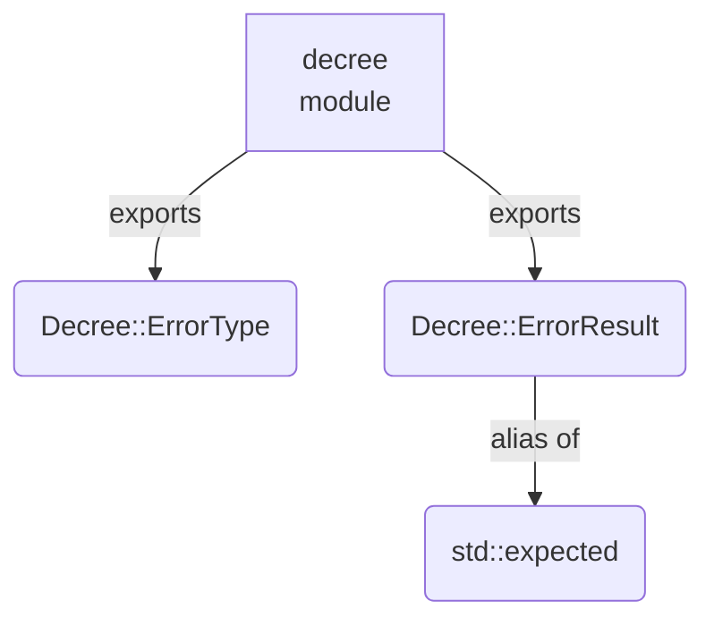
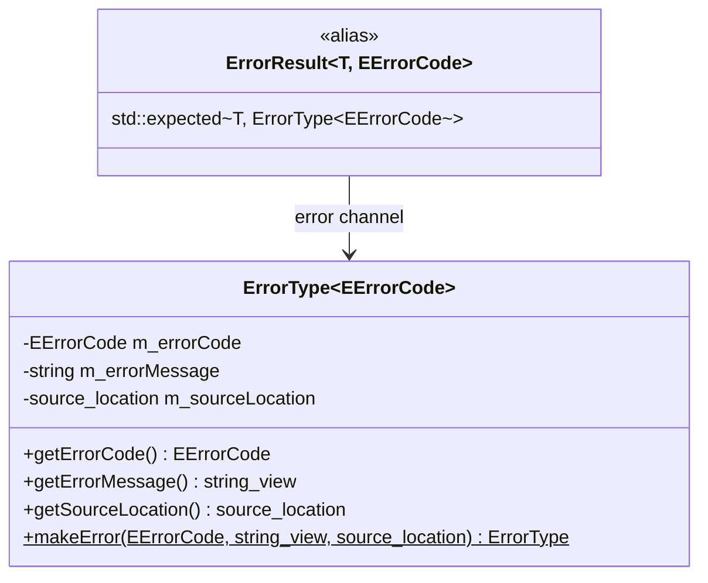

# decree

A lightweight C++23 error-handling wrapper built on `std::expected`. It provides a generic error struct and a result-type alias that forces callers to handle both the success and the failure path.

---

## Table of Contents

1. [Overview](#overview)
2. [Architecture](#architecture)
3. [Modules](#modules)
4. [ErrorType](#errortype)
5. [ErrorResult](#errorresult)
6. [Examples](#examples)
7. [How to build](#how-to-build)
8. [Running the tests](#running-the-tests)

---

## Overview

The wrapper solves two problems:

- **Uniform error representation** — every error carries a typed code (an enum) and a human-readable message. No raw integers, no stringly-typed errors.
- **Explicit failure paths** — functions return `ErrorResult<T, ECode>` instead of throwing. Callers are forced by the type system to handle both outcomes.

The two building blocks are independent and composable:

| Building block | Role |
| --- | --- |
| `Decree::ErrorType<ECode>` | The error value itself |
| `Decree::ErrorResult<T, ECode>` | Return type alias (`std::expected`) |

---

## Architecture

### Module dependency graph



### Error-propagation flow

```mermaid
flowchart LR
    F[function] -->|returns| R{ErrorResult}
    R -->|has_value| V[T — success value]
    R -->|not has_value| E[ErrorType — error value]
    E --> C[getErrorCode()]
    E --> M[getErrorMessage()]
    E --> L[getSourceLocation()]
```

### Type relationships



---

## Modules

| Module | Exported name | File |
| --- | --- | --- |
| `decree` | `Decree::ErrorType`, `Decree::ErrorResult`, `Decree::makeError` | `src/decree.cppm` |

---

## ErrorType

**`Decree::ErrorType<EErrorCode>` — Module:** `decree`

A generic, value-semantic error struct parameterised by a user-defined error-code enum.

### Template parameter

| Parameter | Constraint | Description |
| --- | --- | --- |
| `TErrorCode` | `std::is_enum_v` | An enum (or enum class) whose enumerators identify error categories. |

### Getters

| Getter | Return type | Description |
| --- | --- | --- |
| `getErrorCode()` | `EErrorCode` | Identifies the category of the error. |
| `getErrorMessage()` | `std::string_view` | Human-readable description of what went wrong. |
| `getSourceLocation()` | `std::source_location` | File, line, and function where `makeError` was called. Captured automatically — no extra argument needed. |

### Static factory

```cpp
[[nodiscard]] static ErrorType makeError(EErrorCode code, std::string_view msg,
    std::source_location location = std::source_location::current());
```

Constructs an `ErrorType` from a code and a message. The `location` parameter is filled in automatically by the compiler — callers never pass it explicitly. Prefer this over aggregate initialisation so call sites remain readable if the struct gains new fields.

### Example

```cpp
import decree;

enum class EFileError { 
    eNotFound, 
    ePermissionDenied 
};

auto err = Decree::ErrorType<EFileError>::makeError(EFileError::eNotFound, "config.json was not found");
```

---

## ErrorResult

**`Decree::ErrorResult<T, EErrorCode>` — Module:** `decree`

A type alias for `std::expected<T, ErrorType<EErrorCode>>`. Use it as the return type of any function that can fail.

```cpp
template<typename T, typename EErrorCode>
using ErrorResult = std::expected<T, ErrorType<EErrorCode>>;
```

### Returning a result

```cpp
import decree;

enum class EParseError { 
    eInvalidFormat, 
    eUnexpectedEof 
};

Decree::ErrorResult<int, EParseError> parseNumber(std::string_view input) {
    if(input.empty()) {
        return Decree::makeError(EParseError::eUnexpectedEof, "input was empty");
    }
    // ...
    return 42;
}
```

### Consuming a result

```cpp
auto result = parseNumber("42");

if(result) {
    use(*result);                        // success path
} else {
    log(result.error().getErrorMessage());    // failure path
}
```

### Chaining with `and_then` / `or_else`

```cpp
auto final = parseNumber(raw)
    .and_then(validate)
    .or_else([](auto& err) -> Decree::ErrorResult<int, EParseError> {
        log(err.getErrorMessage());
        return std::unexpected(err);
    });
```

---

## Examples

The following example is adapted from a real consumer of this wrapper. It shows the patterns you will use in practice: defining the error enum inside the class, using a `ReturnType` alias to avoid repeating the enum, propagating errors from nested calls, and returning a void result.

### Defining a class that returns `ErrorResult`

```cpp
import decree;

#include <filesystem>
#include <fstream>
#include <string>

class ConfigurationHandler {
public:
    enum class EError {
        eFileNotFound,
        eParseFailed,
        eWriteFailed
    };

    // Alias keeps return-type declarations short
    template<typename T>
    using ReturnType = Decree::ErrorResult<T, EError>;

    struct Configuration {
        std::string projectName;
        std::string outputPath;
    };

    [[nodiscard]] ReturnType<Configuration> load(const std::filesystem::path& path);
    [[nodiscard]] ReturnType<void> save(const std::filesystem::path& path, const Configuration& config);

private:
    [[nodiscard]] ReturnType<Configuration> parse(std::ifstream& file);
};
```

### Implementing the methods

`load` shows how to propagate an error from a nested call — unwrap the inner result and re-wrap it with the caller's own error code:

```cpp
auto ConfigurationHandler::load(const std::filesystem::path& path) -> ReturnType<Configuration> {
    std::ifstream file{ path };
    if(!file.is_open()) {
        return Decree::makeError(EError::eFileNotFound, "failed to open configuration: " + path.string());
    }

    auto parsed = parse(file);
    if(!parsed.has_value()) {
        return Decree::makeError(EError::eParseFailed, parsed.error().getErrorMessage());
    }

    return *parsed;
}
```

`save` returns `ReturnType<void>`. On the success path, return `{}`:

```cpp
auto ConfigurationHandler::save(const std::filesystem::path& path, const Configuration& config) -> ReturnType<void> {
    std::filesystem::create_directories(path.parent_path());

    std::ofstream file{path};
    if(!file.is_open()) {
        return Decree::makeError(EError::eWriteFailed, "failed to open for writing: " + path.string());
    }

    file << config.projectName << "\n" << config.outputPath;

    return {};
}
```

### Calling the functions

Simple if-check — the most common pattern:

```cpp
ConfigurationHandler handler;

auto config = handler.load("project.json");
if(!config.has_value()) {
    std::cerr << config.error().getErrorMessage() << "\n";
    
    return -1;
}

use(*config);
```

Monadic chaining — load, then immediately save a backup:

```cpp
handler.load("project.json")
    .and_then([&](const ConfigurationHandler::Configuration& cfg) {
        return handler.save("project.backup.json", cfg);
    })
    .or_else([](const auto& err) -> ConfigurationHandler::ReturnType<void> {
        std::cerr << "backup failed: " << err.getErrorMessage() << "\n";
        
        return std::unexpected(err);
    });
```

---

## How to build

### Prerequisites

| Tool | Requirement | Notes |
| --- | --- | --- |
| CMake | 3.28+ | Required for C++23 named-module support |
| C++ compiler | C++23 support | Any conforming compiler works; see tested versions below |
| Ninja | any | Required for Clang and GCC; not needed for MSVC |

#### Tested compilers

| Compiler | Minimum version |
| --- | --- |
| Clang | 17 |
| GCC | 14 |
| MSVC | VS 2022 17.5 |

### Configure and build

**Clang or GCC** — Ninja is required for named-module support:

```sh
cmake -G Ninja -B build -DCMAKE_CXX_COMPILER=clang++
cmake --build build
```

**MSVC** — use the default Visual Studio generator:

```sh
cmake -B build
cmake --build build
```

### Own preset

The repository ships an empty `CMakePresets.json` skeleton. Create a `CMakeUserPresets.json` (already in `.gitignore`) to store your local configuration:

```json
{
    "version": 6,
    "configurePresets": [{
        "name": "my-preset",
        "generator": "Ninja",
        "binaryDir": "${sourceDir}/build",
        "cacheVariables": {
            "CMAKE_CXX_COMPILER": "/path/to/clang++",
            "CMAKE_EXPORT_COMPILE_COMMANDS": "ON"
        }
    }]
}
```

### Build with tests

Pass `-DDECREE_BUILD_TESTS=ON` at configure time:

```sh
cmake -G Ninja -B build -DCMAKE_CXX_COMPILER=clang++ -DDECREE_BUILD_TESTS=ON
cmake --build build
```

### Output

The wrapper is built as a static library target `decree`. Consume it in another CMake project with:

```cmake
find_package(decree REQUIRED)
target_link_libraries(my_target PRIVATE decree::decree)
```

---

## Running the tests

Tests are written with [GoogleTest](https://github.com/google/googletest) v1.14.0 (fetched automatically by CMake via `FetchContent`).

### Run via CTest

```sh
ctest --test-dir build --output-on-failure
```

### Run the test executables directly

```sh
./build/tests/decree_header_test
```

### Test coverage areas

| Test suite | What it verifies |
| --- | --- |
| `ErrorTypeTest` | `makeError` constructs all fields correctly, including `sourceLocation` capture; copy and move semantics |
| `ErrorResultTest` | Success and failure paths; monadic chaining; `sourceLocation` preserved on propagation |
