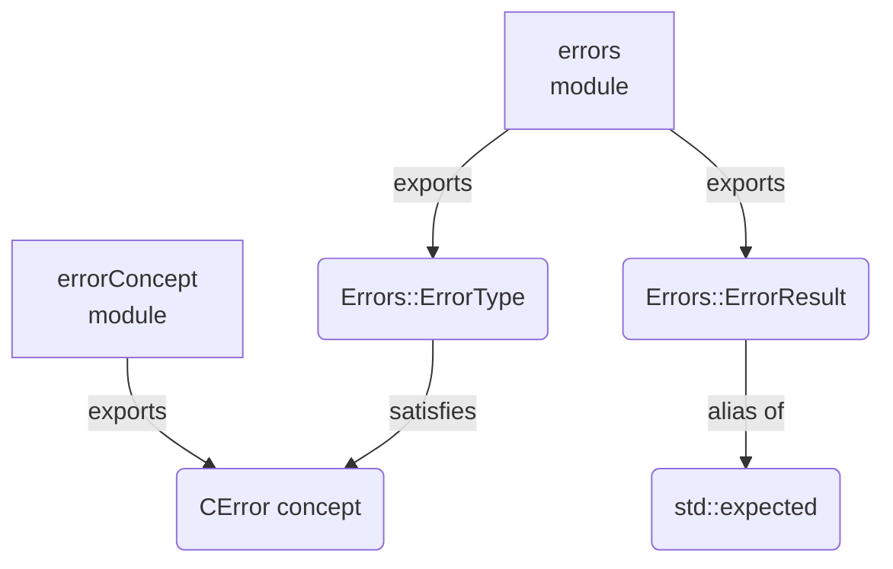
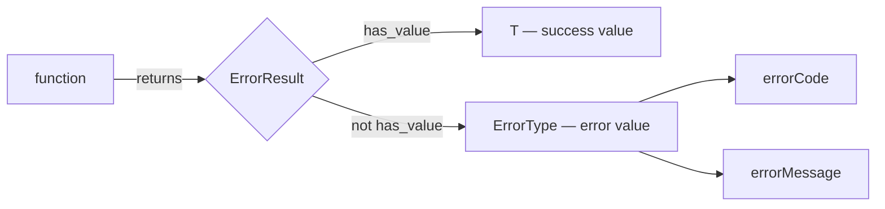
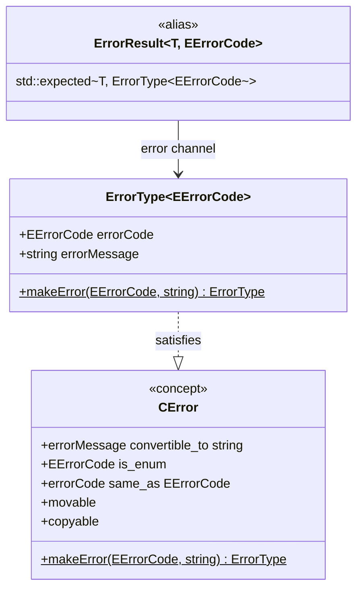

# Error Handling Library

A lightweight C++23 error-handling library built on `std::expected`. It provides a generic error struct, a result-type alias, and a concept that constrains custom error types to the same interface.

---

## Table of Contents

1. [Overview](#overview)
2. [Architecture](#architecture)
3. [Modules](#modules)
4. [ErrorType](#errortype)
5. [ErrorResult](#errorresult)
6. [CError concept](#cerror-concept)
7. [Writing a custom error type](#writing-a-custom-error-type)
8. [How to build](#how-to-build)
9. [Running the tests](#running-the-tests)

---

## Overview

The library solves two problems:

- **Uniform error representation** — every error carries a typed code (an enum) and a human-readable message. No raw integers, no stringly-typed errors.
- **Explicit failure paths** — functions return `ErrorResult<T, ECode>` instead of throwing. Callers are forced by the type system to handle both outcomes.

The three building blocks are independent and composable:

| Building block | Role |
|---|---|
| `Errors::ErrorType<ECode>` | The error value itself |
| `Errors::ErrorResult<T, ECode>` | Return type alias (`std::expected`) |
| `CError` concept | Compile-time constraint for generic code |

---

## Architecture

### Module dependency graph



### Error-propagation flow



### Type relationships



---

## Modules

| Module | Exported name | File |
|---|---|---|
| `errors` | `Errors::ErrorType`, `Errors::ErrorResult` | `src/error_type.cppm` |
| `errorConcept` | `CError` | `src/error_concept.cppm` |

---

## ErrorType

**`Errors::ErrorType<EErrorCode>` — Module:** `errors`

A generic, value-semantic error struct parameterised by a user-defined error-code enum.

### Template parameter

| Parameter | Constraint | Description |
|---|---|---|
| `EErrorCodeParam` | `std::is_enum_v` | An enum (or enum class) whose enumerators identify error categories. |

### Members

| Member | Type | Description |
|---|---|---|
| `errorCode` | `EErrorCode` | Identifies the category of the error. |
| `errorMessage` | `std::string` | Human-readable description of what went wrong. |

### Static factory

```cpp
[[nodiscard]] static ErrorType makeError(EErrorCode code, std::string msg);
```

Constructs an `ErrorType` from a code and a message. Prefer this over aggregate initialisation so call sites remain readable if the struct gains new fields.

### Example

```cpp
import errors;

enum class EFileError { NotFound, PermissionDenied };

auto err = Errors::ErrorType<EFileError>::makeError(
    EFileError::NotFound,
    "config.json was not found"
);
```

---

## ErrorResult

**`Errors::ErrorResult<T, EErrorCode>` — Module:** `errors`

A type alias for `std::expected<T, ErrorType<EErrorCode>>`. Use it as the return type of any function that can fail.

```cpp
template<typename T, typename EErrorCode>
using ErrorResult = std::expected<T, ErrorType<EErrorCode>>;
```

### Returning a result

```cpp
import errors;

enum class EParseError { InvalidFormat, UnexpectedEof };

Errors::ErrorResult<int, EParseError> parseNumber(std::string_view input) {
    if (input.empty())
        return std::unexpected(Errors::ErrorType<EParseError>::makeError(
            EParseError::UnexpectedEof, "input was empty"));
    // ...
    return 42;
}
```

### Consuming a result

```cpp
auto result = parseNumber("42");

if (result)
    use(*result);                        // success path
else
    log(result.error().errorMessage);    // failure path
```

### Chaining with `and_then` / `or_else`

```cpp
auto final = parseNumber(raw)
    .and_then(validate)
    .or_else([](auto& err) -> Errors::ErrorResult<int, EParseError> {
        log(err.errorMessage);
        return std::unexpected(err);
    });
```

---

## `CError` concept

**Module:** `errorConcept`

Constrains a type so it is interchangeable with `ErrorType`. Useful when writing generic utilities (loggers, error reporters) that must work with any conforming error type.

```cpp
template<typename ErrorType>
concept CError = /* ... */;
```

### Requirements

| Requirement | Description |
|---|---|
| `e.errorMessage` convertible to `std::string` | Exposes a human-readable message. |
| `E::EErrorCode` is an enum | Declares its own error-code vocabulary. |
| `e.errorCode` is `E::EErrorCode` | Carries a code instance. |
| `E::makeError(code, msg)` returns `E` | Constructible via the standard factory. |
| `std::movable<E>` and `std::copyable<E>` | Has value semantics. |

`Errors::ErrorType<EErrorCode>` satisfies `CError` for any valid enum `EErrorCode`.

### Example

```cpp
import errorConcept;
import errors;

template<CError E>
void logError(const E& err) {
    std::println("[{}] {}", static_cast<int>(err.errorCode),
                            std::string(err.errorMessage));
}

enum class ENetError { Timeout, Refused };
logError(Errors::ErrorType<ENetError>::makeError(ENetError::Timeout, "connection timed out"));
```

---

## Writing a custom error type

Any struct satisfying the six `CError` requirements works wherever the concept is used:

```cpp
struct MyError {
    enum class EErrorCode { Ok, Overflow, Underflow };

    std::string errorMessage;
    EErrorCode  errorCode;

    static MyError makeError(EErrorCode code, std::string msg) {
        return { std::move(msg), code };
    }
};

static_assert(CError<MyError>);
```

---

## How to build

### Prerequisites

| Tool | Minimum version | Notes |
| --- | --- | --- |
| CMake | 3.28 | Required for C++23 named-module support |
| Clang | 17 | Recommended; set via the `clang-ninja` preset |
| Ninja | any | Required when using Clang or GCC (named modules need Ninja) |
| GCC | 14 | Alternative to Clang |

### Configure and build (using the provided preset)

```sh
# Configure
cmake --preset clang-ninja

# Build
cmake --build --preset clang-ninja
```

The preset targets Windows (`x86_64-w64-mingw32`) using the LLVM toolchain at `C:/Program Files/LLVM/`.

### Configure manually

```sh
cmake -G Ninja -B build \
    -DCMAKE_CXX_COMPILER=clang++ \
    -DCMAKE_CXX_STANDARD=23
cmake --build build
```

### Build with tests

Pass `-DCONDAIR_ERROR_HANDLING_BUILD_TESTS=ON` at configure time:

```sh
cmake --preset clang-ninja -DCONDAIR_ERROR_HANDLING_BUILD_TESTS=ON
cmake --build --preset clang-ninja
```

> **Windows / LLVM note:** The MinGW C++ runtime implements `std::mutex` via pthreads. The test target links `Threads::Threads` (resolved to `-lpthread` / winpthreads by CMake) to satisfy those symbols on the LLVM/MinGW toolchain.

### Output

The library is built as a static library target `condair::error_handling_library`. Consume it in another CMake project with:

```cmake
find_package(condair_error_handling_library REQUIRED)
target_link_libraries(my_target PRIVATE condair::error_handling_library)
```

---

## Running the tests

Tests are written with [GoogleTest](https://github.com/google/googletest) v1.14.0 (fetched automatically by CMake via `FetchContent`).

### Run via CTest preset

```sh
ctest --preset clang-ninja
```

### Run via CTest manually

```sh
ctest --test-dir build --output-on-failure
```

### Run the test executable directly

```sh
./build/tests/condair_error_handling_test
```

### Test coverage areas

| Test suite | What it verifies |
| --- | --- |
| `ErrorTypeTest` | `makeError` constructs fields correctly; `EErrorCode` constraint is enforced |
| `ErrorResultTest` | Success and failure paths of `ErrorResult`; monadic chaining |
| `CErrorConceptTest` | `ErrorType` satisfies `CError`; non-conforming types are rejected |
| `CustomErrorTypeTest` | A hand-written struct satisfies `CError` |
