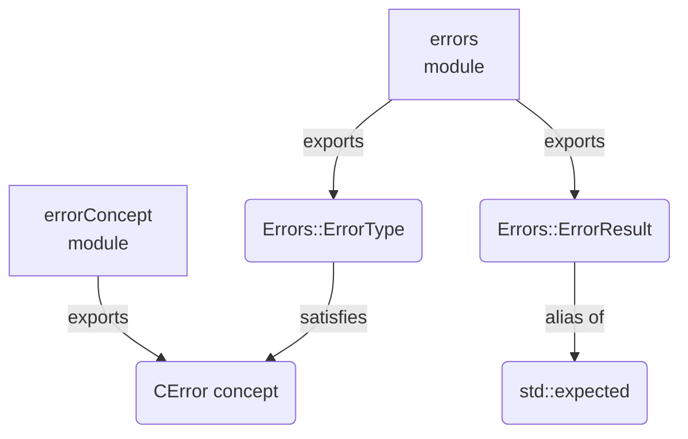
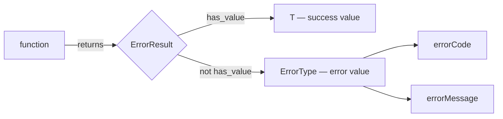
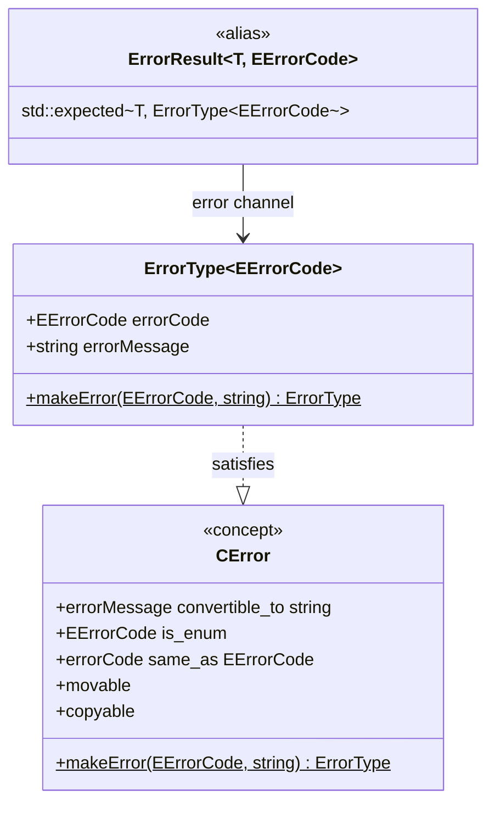

# decree

A lightweight C++23 error-handling library built on `std::expected`. It provides a generic error struct, a result-type alias, and a concept that constrains custom error types to the same interface.

---

## Table of Contents

1. [Overview](#overview)
2. [Architecture](#architecture)
3. [Modules](#modules)
4. [ErrorType](#errortype)
5. [ErrorResult](#errorresult)
6. [CError concept](#cerror-concept)
7. [Writing a custom error type](#writing-a-custom-error-type)
8. [Examples](#examples)
9. [How to build](#how-to-build)
10. [Running the tests](#running-the-tests)

---

## Overview

The library solves two problems:

- **Uniform error representation** — every error carries a typed code (an enum) and a human-readable message. No raw integers, no stringly-typed errors.
- **Explicit failure paths** — functions return `ErrorResult<T, ECode>` instead of throwing. Callers are forced by the type system to handle both outcomes.

The three building blocks are independent and composable:

| Building block | Role |
|---|---|
| `Errors::ErrorType<ECode>` | The error value itself |
| `Errors::ErrorResult<T, ECode>` | Return type alias (`std::expected`) |
| `CError` concept | Compile-time constraint for generic code |

---

## Architecture

### Module dependency graph



### Error-propagation flow



### Type relationships



---

## Modules

| Module          | Exported name                                                    | File                              |
|-----------------|------------------------------------------------------------------|-----------------------------------|
| `errors`        | `Errors::ErrorType`, `Errors::ErrorResult`, `Errors::makeError`  | `src/error_handling_module.cppm`  |
| `errorConcept`  | `CError`                                                         | `src/error_concept_module.cppm`   |

---

## ErrorType

**`Errors::ErrorType<EErrorCode>` — Module:** `errors`

A generic, value-semantic error struct parameterised by a user-defined error-code enum.

### Template parameter

| Parameter | Constraint | Description |
|---|---|---|
| `TErrorCode` | `std::is_enum_v` | An enum (or enum class) whose enumerators identify error categories. |

### Members

| Member | Type | Description |
|---|---|---|
| `errorCode` | `EErrorCode` | Identifies the category of the error. |
| `errorMessage` | `std::string` | Human-readable description of what went wrong. |

### Static factory

```cpp
[[nodiscard]] static ErrorType makeError(EErrorCode code, std::string msg);
```

Constructs an `ErrorType` from a code and a message. Prefer this over aggregate initialisation so call sites remain readable if the struct gains new fields.

### Example

```cpp
import errors;

enum class EFileError { NotFound, PermissionDenied };

auto err = Errors::ErrorType<EFileError>::makeError(
    EFileError::NotFound,
    "config.json was not found"
);
```

---

## ErrorResult

**`Errors::ErrorResult<T, EErrorCode>` — Module:** `errors`

A type alias for `std::expected<T, ErrorType<EErrorCode>>`. Use it as the return type of any function that can fail.

```cpp
template<typename T, typename EErrorCode>
using ErrorResult = std::expected<T, ErrorType<EErrorCode>>;
```

### Returning a result

```cpp
import errors;

enum class EParseError { InvalidFormat, UnexpectedEof };

Errors::ErrorResult<int, EParseError> parseNumber(std::string_view input) {
    if(input.empty()) {
        return Errors::makeError(EParseError::UnexpectedEof, "input was empty");
    }
    // ...
    return 42;
}
```

### Consuming a result

```cpp
auto result = parseNumber("42");

if (result)
    use(*result);                        // success path
else
    log(result.error().errorMessage);    // failure path
```

### Chaining with `and_then` / `or_else`

```cpp
auto final = parseNumber(raw)
    .and_then(validate)
    .or_else([](auto& err) -> Errors::ErrorResult<int, EParseError> {
        log(err.errorMessage);
        return std::unexpected(err);
    });
```

---

## `CError` concept

**Module:** `errorConcept`

Constrains a type so it is interchangeable with `ErrorType`. Useful when writing generic utilities (loggers, error reporters) that must work with any conforming error type.

```cpp
template<typename ErrorType>
concept CError = /* ... */;
```

### Requirements

| Requirement | Description |
|---|---|
| `e.errorMessage` convertible to `std::string` | Exposes a human-readable message. |
| `decltype(e.errorCode)` is an enum | The error code field must be an enum or enum class. |
| `E::makeError(e.errorCode, e.errorMessage)` returns `E` | Constructible via the standard factory. |
| `std::movable<E>` and `std::copyable<E>` | Has value semantics. |

`Errors::ErrorType<EErrorCode>` satisfies `CError` for any valid enum `EErrorCode`.

### Example

```cpp
import errorConcept;
import errors;

template<CError E>
void logError(const E& err) {
    std::println("[{}] {}", static_cast<int>(err.errorCode),
                            std::string(err.errorMessage));
}

enum class ENetError { Timeout, Refused };
logError(Errors::ErrorType<ENetError>::makeError(ENetError::Timeout, "connection timed out"));
```

---

## Writing a custom error type

Any struct satisfying the six `CError` requirements works wherever the concept is used:

```cpp
struct MyError {
    enum class EErrorCode { Ok, Overflow, Underflow };

    std::string errorMessage;
    EErrorCode  errorCode;

    static MyError makeError(EErrorCode code, std::string msg) {
        return { std::move(msg), code };
    }
};

static_assert(CError<MyError>);
```

---

## Examples

The following example is adapted from a real consumer of the library. It shows the patterns you will use in practice: defining the error enum inside the class, using a `ReturnType` alias to avoid repeating the enum, propagating errors from nested calls, and returning a void result.

### Defining a class that returns `ErrorResult`

```cpp
import errors;

#include <filesystem>
#include <fstream>
#include <string>

class ConfigurationHandler {
public:
    enum class EError {
        eFileNotFound,
        eParseFailed,
        eWriteFailed
    };

    // Alias keeps return-type declarations short
    template<typename T>
    using ReturnType = Errors::ErrorResult<T, EError>;

    struct Configuration {
        std::string projectName;
        std::string outputPath;
    };

    [[nodiscard]] ReturnType<Configuration> load(const std::filesystem::path& path);
    [[nodiscard]] ReturnType<void> save(const std::filesystem::path& path, const Configuration& config);

private:
    [[nodiscard]] ReturnType<Configuration> parse(std::ifstream& file);
};
```

### Implementing the methods

`load` shows how to propagate an error from a nested call — unwrap the inner result and re-wrap it with the caller's own error code:

```cpp
auto ConfigurationHandler::load(const std::filesystem::path& path) -> ReturnType<Configuration> {
    std::ifstream file{ path };
    if (!file.is_open()) {
        return Errors::makeError(EError::eFileNotFound, "failed to open configuration: " + path.string());
    }

    auto parsed = parse(file);
    if (!parsed.has_value()) {
        return Errors::makeError(EError::eParseFailed, parsed.error().errorMessage);
    }

    return *parsed;
}
```

`save` returns `ReturnType<void>`. On the success path, return `{}`:

```cpp
auto ConfigurationHandler::save(const std::filesystem::path& path, const Configuration& config) -> ReturnType<void> {
    std::filesystem::create_directories(path.parent_path());

    std::ofstream file{path};
    if (!file.is_open()) {
        return Errors::makeError(EError::eWriteFailed, "failed to open for writing: " + path.string());
    }

    file << config.projectName << "\n" << config.outputPath;

    return {};
}
```

### Calling the functions

Simple if-check — the most common pattern:

```cpp
ConfigurationHandler handler;

auto config = handler.load("project.json");
if (!config.has_value()) {
    std::cerr << config.error().errorMessage << "\n";
    
    return -1;
}

use(*config);
```

Monadic chaining — load, then immediately save a backup:

```cpp
handler.load("project.json")
    .and_then([&](const ConfigurationHandler::Configuration& cfg) {
        return handler.save("project.backup.json", cfg);
    })
    .or_else([](const auto& err) -> ConfigurationHandler::ReturnType<void> {
        std::cerr << "backup failed: " << err.errorMessage << "\n";
        
        return std::unexpected(err);
    });
```

---

## How to build

### Prerequisites

| Tool | Requirement | Notes |
| --- | --- | --- |
| CMake | 3.28+ | Required for C++23 named-module support |
| C++ compiler | C++23 support | Any conforming compiler works; see tested versions below |
| Ninja | any | Required for Clang and GCC; not needed for MSVC |

#### Tested compilers

| Compiler | Minimum version |
| --- | --- |
| Clang | 17 |
| GCC | 14 |
| MSVC | VS 2022 17.5 |

### Configure and build

**Clang or GCC** — Ninja is required for named-module support:

```sh
cmake -G Ninja -B build -DCMAKE_CXX_COMPILER=clang++
cmake --build build
```

**MSVC** — use the default Visual Studio generator:

```sh
cmake -B build
cmake --build build
```

### Own preset

The repository ships an empty `CMakePresets.json` skeleton. Create a `CMakeUserPresets.json` (already in `.gitignore`) to store your local configuration:

```json
{
    "version": 6,
    "configurePresets": [{
        "name": "my-preset",
        "generator": "Ninja",
        "binaryDir": "${sourceDir}/build",
        "cacheVariables": {
            "CMAKE_CXX_COMPILER": "/path/to/clang++",
            "CMAKE_EXPORT_COMPILE_COMMANDS": "ON"
        }
    }]
}
```

### Build with tests

Pass `-DDECREE_BUILD_TESTS=ON` at configure time:

```sh
cmake -G Ninja -B build -DCMAKE_CXX_COMPILER=clang++ -DDECREE_BUILD_TESTS=ON
cmake --build build
```

### Output

The library is built as a static library target `decree`. Consume it in another CMake project with:

```cmake
find_package(decree REQUIRED)
target_link_libraries(my_target PRIVATE decree::decree)
```

---

## Running the tests

Tests are written with [GoogleTest](https://github.com/google/googletest) v1.14.0 (fetched automatically by CMake via `FetchContent`).

### Run via CTest

```sh
ctest --test-dir build --output-on-failure
```

### Run the test executable directly

```sh
./build/tests/decree_test
```

### Test coverage areas

| Test suite | What it verifies |
| --- | --- |
| `ErrorTypeTest` | `makeError` constructs fields correctly; `EErrorCode` constraint is enforced |
| `ErrorResultTest` | Success and failure paths of `ErrorResult`; monadic chaining |
| `CErrorConceptTest` | `ErrorType` satisfies `CError`; non-conforming types are rejected |
| `CustomErrorTypeTest` | A hand-written struct satisfies `CError` |
